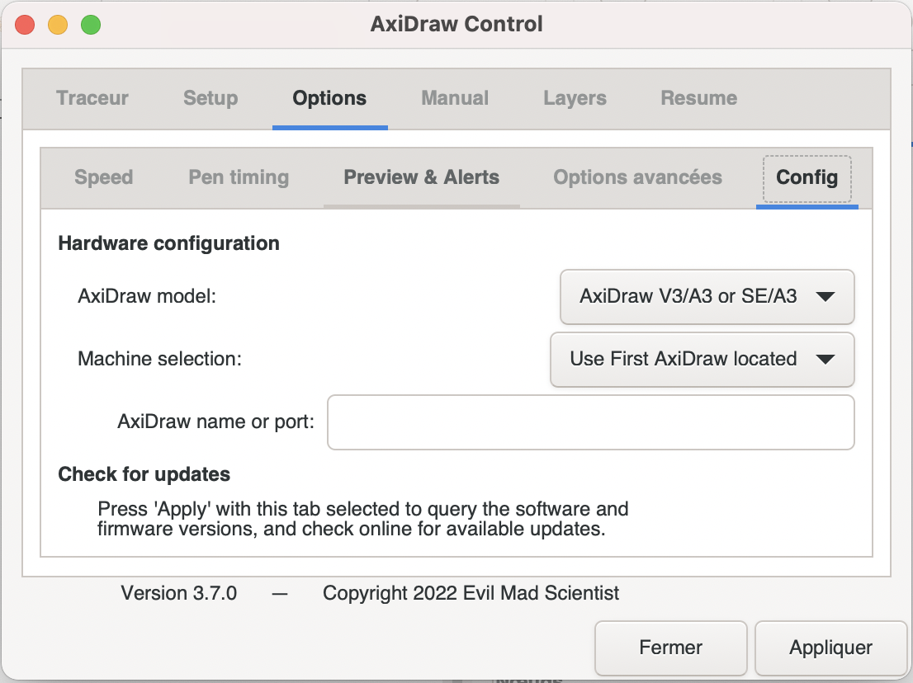

# 🚧🚧 Axidraw_sp33d 🚧🚧

**On how to use with almost full autonomy the Axidraw with a .svg and Inkscape.**

Prerequisite : being at the digital workshop,  having installed [Inkscape](https://inkscape.org) and the [Axidraw extension](https://wiki.evilmadscientist.com/Axidraw_Software_Installation).

## Setup

Plug in the Axidraw and plug in the USB cable to your computer.

Open your .svg with Inkscape.

Disable the motors on the Axidraw with `Extensions` > `AxiDraw Utilities` > `Disable XY Motors`.

After the motors are disabled, you carefully can move the pen holder in the top right corner. You should not have to force to move the pen holder.

//photo

Place the paper on the metal sheet, and secure it with magnets.

//photo

In the `Manual` tab, raise the pen.

Place the pen of your choice in the pen holder, it should be around 1mm above the paper.

//photo

## Controls

Open the Axidraw menu in `Extensions` > `AxiDraw Control...`.

-> In the Axidraw control menu, each tab control different actions you can do by clicking `Apply`. 

The first tab, `Plotter`, will start the plot when you click `Apply`.

In the `Setup` tab, you can choose the height of the pen in the up and down positions.

In the `Options` tab, you can choose differents settings, such as the speed.

It is important to make sure to select the right model of Axidraw in the `Config` part, to have the right plot size : here the A3 Axidraw to plot in A3.

In the `Manual` tab, you can choose an action to execute when clicking `Apply`.

You can also enable or disable the motors here.

In the `Layers` tab, you can select a particular layer to be plotted.

In the `Resume` tab, you can select an action to execute after pausing the plot.

## Plotting

Open the Axidraw menu, and click `Apply` in the `Plotter` tab to plot without differencing the layers. The Axidraw will then plot every visible layers.

You can pause the plot with the button on the top side of the Axidraw.

To plot one layer at the time, add a number as a prefix to the name of each layer. For example : "1-layerblue", "2-layergreen", etc.

Open the `Layers` tab of the Axidraw menu, and select which layer number you want plotted, then click `Apply`.

# To go further

The [Axidraw Inkscape extension user guide](https://www.manualslib.com/manual/1235134/Evil-Mad-Scientist-Axidraw.html).

A [video explaining how to use the extension](https://www.youtube.com/watch?v=r5mhw8-nrg0).
